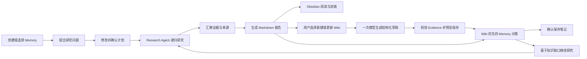
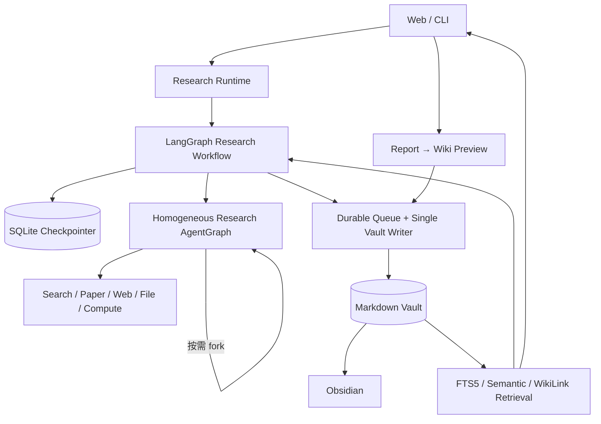

<div align="center">

# 🔬 PaperPilot

### 递归 Deep Research × LLM Wiki × Obsidian

把一次性研究，沉淀为可追溯、可问答、可继续生长的长期知识。

[](https://python.org)
[](https://www.langchain.com/langgraph)
[](#-测试)
[](LICENSE)

</div>

---

## 📖 项目介绍

大多数研究 Agent 在交付报告后就结束了：下一次提问仍要从头搜索，历史证据散落在会话中，也很难在自己熟悉的知识管理工具里继续整理。

**PaperPilot** 是一个基于 LangGraph 的个人深度研究系统。它让用户先确认研究计划，再由同质 Research Agent 递归拆解问题、并行检索和汇聚证据；研究结果会写入长期 Markdown Memory，并通过 **LLM Wiki** 与 **Obsidian** 进入后续的问答、笔记和继续研究流程。

```text
一次研究：问题 → 计划确认 → 递归研究 → 带来源的报告
长期积累：报告 → 用户确认整理为 Wiki → Memory 问答 → 新笔记 / 继续研究
```

## ✨ 三项核心能力

| 能力 | PaperPilot 做什么 | 解决的问题 |
|---|---|---|
| 🔎 **递归 Deep Research** | 同一种 Research Agent 按需 fork，搜索网页、论文和本地资料，汇聚可追溯证据 | 复杂问题难以一次检索完整 |
| 🧠 **LLM Wiki** | 将报告整理为持续更新、逐条引用 Evidence 的 Wiki 专题页，支持 Wiki 优先问答与基于旧知识继续研究 | 多份研究难以融合为当前知识 |
| 🗂️ **Obsidian 原生工作流** | 使用 Markdown、frontmatter 和 WikiLink 落盘，可直接在 Obsidian 中阅读、编辑和浏览双链 | 知识被锁在聊天界面或专有数据库中 |

### 1. 递归 Deep Research

- 用户可以修改并确认 Research Brief，确认前不会启动正式研究；
- 根 Agent、子 Agent 和孙 Agent 运行同一个 AgentGraph，只在身份、深度和预算上不同；
- Agent 根据证据缺口决定继续调用工具、停止或 fork，整棵执行树共享递归、线程、工具和时间预算；
- 搜索、论文、网页、文件和计算结果最终汇聚为带来源的 Markdown 报告；
- 可选 Red/Blue 审查用于报告质量复核，不改变主研究架构。

### 2. LLM Wiki：让研究成为长期记忆

PaperPilot 的 LLM Wiki 不是另一个 Markdown 编辑器，而是建立在可追溯 Research Memory 之上的知识层：

- 一个 Vault 可以包含多个稳定的 `memory_id`，Memory 不依赖某次 session 或 thread；
- 报告、Wiki、证据、来源、笔记和导入资料通过 WikiLink 形成知识网络；
- 已完成报告可以由用户手动创建或更新为 Wiki 专题页，不自动触发第二次模型整理；
- Wiki 整理只调用一次模型；模型输出结构化 Claim，路径、frontmatter 和 WikiLink 由程序生成；
- 用户预览后才保存；保存时重新校验报告哈希、页面哈希和 Evidence ID；
- Memory 问答优先检索 Wiki，尚未建立或没有命中 Wiki 时兼容检索原有报告、Evidence 与笔记；
- 可以把回答整理为笔记，或导入 PDF、文本和网页；所有写入都先预览、再确认；
- 新研究会读取已有结论与知识缺口，在同一 Memory 中继续扩展；
- SQLite FTS5、可选本地语义召回和 WikiLink 邻居组成混合检索，索引可随时从 Markdown 重建。

#### LLM Wiki 三层

```text
Raw / Source：原始附件、工具 Artifact 和来源定位，不由 Wiki 生成过程改写
Evidence / Report：可定位的原子证据与单次研究快照
Wiki：用户触发、LLM 辅助维护的当前专题知识
```

Schema/Governance 横跨三层，约束页面身份、路径、引用和写入边界。Report 保留历史，Wiki 持续更新；两者共享 Evidence，但研究完成时不会自动修改 Wiki。

### 3. Obsidian 原生，而不是自建编辑器

PaperPilot 负责研究、检索、引用和受控写入；Obsidian 负责阅读、手工编辑、backlinks 与知识图谱。Vault 中的 Markdown 是唯一知识真相源，PaperPilot 不要求安装 Obsidian 插件，也不会改写 `.obsidian/`。

```text
memory/
└── Memories/
    └── M-.../
        ├── Home.md
        ├── reports/
        ├── evidence/
        ├── sources/
        ├── wiki/
        ├── notes/
        ├── imports/
        └── attachments/
```

## 🔄 完整使用链路



这条链路的重点不是“生成一篇报告”，而是让报告进入一个可以持续检索、验证和扩展的个人研究空间。

## 🚀 快速开始

推荐 Python 3.11。

### 1. 安装

```bash
git clone https://github.com/boluodaixue/paperpilot.git
cd paperpilot

python -m venv .venv
source .venv/bin/activate
python -m pip install -r requirements.txt
cp .env.template .env
```

Windows PowerShell：

```powershell
python -m venv .venv
.venv\Scripts\Activate.ps1
python -m pip install -r requirements.txt
Copy-Item .env.template .env
```

在 `.env` 中填写模型和检索服务所需的 API Key。项目支持 DeepSeek、OpenAI、MiMo 和本地 OpenAI-compatible vLLM。

网页搜索默认使用 `Tavily → 秘塔 → Exa → 博查 → SerpAPI` 回退链，只调用已配置 Key 的备用源，无需部署 SearXNG 或其他常驻服务。首选源故障时会自动切换，但仍向界面发送明确的来源不可用告警；所有已配置来源都失败时才暂停整个网页搜索工具。

论文检索把 `ARXIV_READER_BACKEND` 作为首选项，并在失败或空结果时自动在 arXiv、Semantic Scholar 和 OpenAlex 之间回退。裸 arXiv ID 会先按 arXiv 标识符查询，不会再误拼为 OpenAlex Work ID。外部 HTTPS 工具统一使用平台信任库与 Mozilla CA；网页返回 403 时，只会尝试同一发布方可验证的官方 PDF，不关闭证书校验或绕过访问控制。

### 2. 启动 Web

```bash
python web/run.py
```

打开 <http://127.0.0.1:8000>，创建或选择一个 Memory，然后开始研究。

### 3. 整理报告到 Wiki

在 Web 中完成一份绑定到 managed Memory 的研究后：

1. 点击报告下方的“整理到 Wiki”；
2. 选择“新建 Wiki 页面”或一个已有页面；
3. 生成并检查完整 Markdown 预览；
4. 点击“保存到 Wiki”。

系统会自动沿报告中的 WikiLink 读取相关 Evidence。模型不能自行创建 Evidence ID；报告或目标 Wiki 在预览后发生变化时，保存会被拒绝，避免覆盖 Obsidian 中的并发编辑。

### 4. 在 Obsidian 中打开

把 `configs/default.yaml` 中 `research.vault_root` 指向的目录作为 Obsidian Vault 打开。默认目录是项目下的 `memory/`。

## 💻 命令行使用（可选）

除 Web 界面外，也可以从终端发起研究。先在 Web 中创建 Memory，再将下面的 `M-your-memory` 替换为实际 ID；运行后按提示确认研究提案。

```bash
python scripts/run_single.py --memory-id M-your-memory --query "分析 AI Agent Memory 的演进、评测方法与关键证据"
```

交互式终端支持连续使用，输入 `new-memory 专题名称` 可创建并选择 Memory：

```bash
python scripts/run_repl.py
```

## 📊 Benchmark 与评测

先完成模型与搜索服务配置；真实评测会调用模型和检索服务，可能产生费用。以下命令在项目根目录执行，结果默认保存到 `outputs/evaluation/`。

### 自建 ResearchBench

内置 **35 道**跨领域深度研究题，用于研究质量回归，记录覆盖度、引用等规则指标；加上 `--llm-judge` 可启用模型评分。

```bash
python scripts/run_eval.py --benchmark research_bench --num-questions 2 --llm-judge
```

题目及预期主题、关键事实见 [ResearchBench 题集](evaluation/benchmarks/research_bench.py)。可在题集中添加题目，或用 `--question-ids` 指定题目 ID。若要用自己的问题对比单轮 LLM 与完整 Agent，将问题按每行一题保存后运行：

```bash
python scripts/run_benchmark.py --queries_file my_queries.txt
```

对比结果保存到 `outputs/benchmark_results.json`。

### 公开 benchmark

- **HotpotQA**：多跳问答评测，运行 `python scripts/run_eval.py --benchmark hotpotqa --num-questions 2`。
- **DeepResearch Bench II**：使用公开任务与 Rubric；仓库包含独立适配/计分代码、冻结配置、题目选择及精简运行汇总，详见 [实验说明](experiments/drbench2/README.md)。当前主汇报口径为排除题 25、42 后的自选 10 题子集，得分 **42.70%**，详见 [当前 10 题口径](experiments/drbench2/user-multi-holdout-20260906/当前10题口径.md)。

DeepResearch Bench II 当前使用选定子集与项目 DeepSeek Judge，属于自定义评测，**不是官方全量 132 题、官方 Gemini Judge 的榜单成绩**。体积较大或可能包含运行上下文的原始报告、模型响应、数据库、日志与检查点仅保留在本地，不提交仓库。

## 🏗️ 架构概览



几个关键设计：

- **工作流可恢复**：LangGraph checkpoint 持久化研究阶段和 interrupt，服务重启后可继续等待中的流程；
- **写入可恢复**：持久队列与单一 Vault Writer 串行提交，通过 staging、journal、内容哈希和原子发布处理崩溃与重复请求；
- **知识不锁定**：SQLite 检索数据只是可重建索引，不能反向覆盖 Markdown；
- **人在回路中**：研究计划、Wiki 更新、保存笔记、导入资料和 legacy 迁移均需要用户确认。

更完整的设计说明见 [架构文档](docs/ARCHITECTURE.md)。

## 🧭 项目演进

| 阶段 | 主要变化 |
|---|---|
| DeepResearch Agent 原型 | 建立规划、检索、Memory、报告与评测基础 |
| PaperPilot 研究闭环 | 加入证据层、证据图、Web UI、动态 fork 和 Obsidian 导出探索 |
| LangGraph 主线重构 | 收敛为同质 Research AgentGraph，补齐确认、递归边界与 checkpoint 恢复 |
| LLM Wiki + Obsidian | 完成长期 Memory、受控笔记与导入、崩溃一致写入、全文与混合检索 |
| 研究充分性与终止机制 | 根据研究要求、已有证据与下一步价值决定继续、重规划或停止，分别记录研究状态、停止原因与报告状态 |
| 三层研究上下文 | 加入 L1–L3 上下文管理、语义摘要与原始资料受控回读，控制长任务上下文规模 |
| 用户驱动 Wiki | 增加 Report → Wiki 单次模型整理、Claim 级 Evidence 引用、预览保存与 Wiki 优先问答 |

## 🧪 测试

```bash
pytest -q
```

测试覆盖研究流程与预算、故障恢复、知识库读写与检索，以及网页和命令行入口；结果以当前版本的实际运行输出为准。

## 🛠️ 技术栈

| 层级 | 技术 |
|---|---|
| Agent 工作流 | LangGraph |
| Web | FastAPI + SSE |
| 模型 | DeepSeek / OpenAI / MiMo / vLLM |
| 知识存储 | Markdown + frontmatter + WikiLink |
| 工作流持久化 | SQLite Checkpointer |
| 检索 | SQLite FTS5 + sentence-transformers + WikiLink |
| 可观测性 | Langfuse |
| 知识管理 | Obsidian |

## 📁 项目结构

```text
paperpilot/
├── configs/          # 模型、工具、Runtime 与检索配置
├── docs/             # 当前架构与路线图
├── evaluation/       # 评测题集、评分与结果汇总
├── experiments/      # 公开基准实验适配与运行记录
├── scripts/          # CLI、评测和模型准备工具
├── src/research/     # Workflow、AgentGraph、Memory、Wiki、Writer、Retrieval
├── src/tools/        # 搜索、论文、网页、文件与计算工具
├── tests/            # 确定性测试和故障注入
└── web/              # FastAPI + 本地 Web UI
```

## 📄 License

[MIT](LICENSE)
