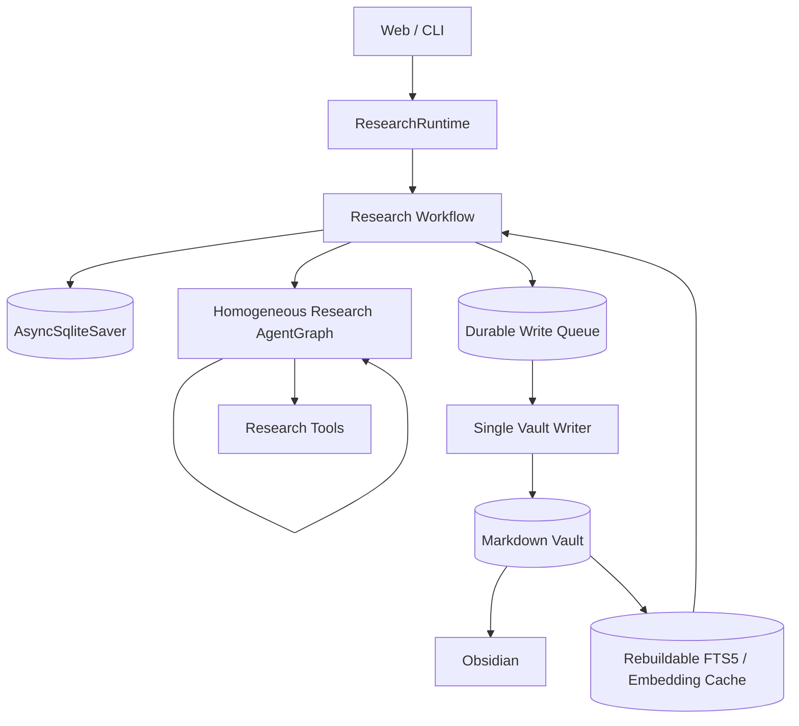

<div align="center">

# PaperPilot

### 基于 LangGraph 的可恢复递归研究 Agent 与 Obsidian Memory 系统

[](https://python.org)
[](https://www.langchain.com/langgraph)
[](#测试)
[](LICENSE)

</div>

PaperPilot 把一次深度研究做成可确认、可递归、可恢复、可继续积累的工作流。它不是一次性聊天封装：研究任务会经过计划确认，由同一种 Research Agent 按需并行 fork，在硬预算内汇聚证据，最终把报告、证据和来源写入长期 Markdown Vault，并可在 Obsidian 中阅读、编辑和继续研究。

## 30 秒了解项目

- **同质递归 Agent**：根、子、孙运行同一个 AgentGraph；只有执行身份、深度和预算不同。
- **人在回路中**：研究计划、保存笔记、导入资料和 legacy 迁移都必须先预览再确认。
- **真正可恢复**：LangGraph State 使用 SQLite checkpointer 持久化，进程重启后可以继续等待中的研究与确认。
- **可靠写入 Markdown**：持久队列和单一 Vault Writer 使用 staging、journal、内容哈希与幂等恢复发布多文件变更。
- **长期 Memory**：一个 Vault 中管理多个稳定 `memory_id`，报告、证据、来源、笔记和导入资料彼此 WikiLink。
- **可选混合检索**：SQLite FTS5、当前 Memory 的本地多语言语义召回和 WikiLink 邻居以确定性 RRF 合并；模型不可用时降级到全文检索。
- **Obsidian 友好**：PaperPilot 负责研究和受控写入，Obsidian 负责阅读、编辑与 backlinks，不写 `.obsidian/`。

## 演示链路


一条完整的作品演示建议覆盖：

1. 创建或选择 Memory；
2. 修改并确认研究计划；
3. 观察根 Agent fork 同质子 Agent；
4. 查看带证据和来源的 Markdown 报告；
5. 在 Obsidian 中打开报告；
6. 对当前 Memory 提问，或基于旧结论继续研究。

真实模型演示的截图、录屏和样例报告会在正式试跑后加入，仓库不会用离线 fixture 冒充真实运行结果。

## 核心架构



### 同一种 Agent，而不是角色流水线

根、子、孙都执行 `src/research/agent_graph.py` 中的同一个 Research AgentGraph。Agent 自己判断继续工具循环、停止或 fork；孙级禁止继续 fork。总线程数、工具调用、时间、token 和重试预算在整棵执行树中共享。

### 工作流状态与运行账本分离

LangGraph State 是任务阶段、Research Brief、interrupt、确认、提案和结果的唯一工作流状态。PaperPilot Runtime Registry 只保存 session/task/thread 定位、恢复租约和必要事件 outbox，不复制第二套业务状态机。

### Markdown 是唯一知识真相源

```text
memory/
└── Memories/
    └── M-.../
        ├── Home.md
        ├── reports/
        ├── evidence/
        ├── sources/
        ├── notes/
        ├── imports/
        └── attachments/
```

SQLite 检索库和 embedding 都是可删除重建的派生数据，不能反向覆盖 Markdown，也不是第二知识库。

### 崩溃一致的 Vault 写入

所有产品写入先进入持久队列，再由唯一 Writer 串行提交。Writer 在 Vault 同卷 staging 中准备完整变更，通过 journal、generation fencing、内容哈希和原子发布处理进程崩溃、重复请求与外部编辑冲突。

详细设计见 [架构说明](docs/ARCHITECTURE.md)。

## 快速开始

### 1. 安装

推荐 Python 3.11。

```bash
git clone https://github.com/boluodaixue/paperpilot.git
cd paperpilot

python -m venv .venv
source .venv/bin/activate
python -m pip install -r requirements.txt
cp .env.template .env
```

Windows PowerShell：

```powershell
python -m venv .venv
.venv\Scripts\Activate.ps1
python -m pip install -r requirements.txt
Copy-Item .env.template .env
```

在 `.env` 中至少填写所选模型后端的 API Key。默认配置使用 DeepSeek，也可以切换到 OpenAI、MiMo 或本地 OpenAI-compatible vLLM。

### 2. 启动 Web

```bash
python web/run.py
```

打开 <http://127.0.0.1:8000>，先创建一个 Memory，再开始研究。

### 3. 连接 Obsidian

在 Obsidian 中把 `configs/default.yaml` 的 `research.vault_root` 目录作为 Vault 打开；默认是项目下的 `memory/`。PaperPilot 不要求安装插件，也不会修改 `.obsidian/`。

### CLI

```bash
python scripts/run_single.py \
  --memory-id M-your-memory \
  --query "分析 AI Agent Memory 的演进、评测方法与关键证据"
```

交互式入口：

```bash
python scripts/run_repl.py
```

## 可选语义检索

默认只启用稳定、轻量的 SQLite FTS5。需要多语言语义召回时，先检查本地模型：

```bash
python scripts/prepare_semantic_model.py --check
```

首次下载模型：

```bash
python scripts/prepare_semantic_model.py --download
```

然后修改 `configs/default.yaml`：

```yaml
runtime:
  semantic_retrieval_enabled: true
  semantic_embedding_model: "sentence-transformers/paraphrase-multilingual-MiniLM-L12-v2"
  semantic_local_files_only: true
```

启动时会显示检索模式；查询期间若模型缺失或向量异常，日志会明确提示降级到 SQLite FTS5，不会生成伪随机向量。

## 测试

```bash
pytest -q
```

当前确定性测试结果：

```text
702 passed, 2 skipped
```

测试覆盖同质递归、预算与取消、checkpoint 恢复、用户确认、多 Memory 隔离、Writer 崩溃恢复、并发冲突、Markdown/WikiLink 契约、受控导入、FTS5、语义降级和 Web/CLI 入口。真实模型、真实网络与 Obsidian 启动作为单独 smoke test，不用外部服务稳定性替代离线验收。

## 项目结构

```text
paperpilot/
├── configs/          # 模型、工具、Runtime 与检索配置
├── docs/             # 当前架构、路线图和精选技术记录
├── evaluation/       # 固定离线评测
├── scripts/          # CLI、评测与模型准备工具
├── src/research/     # Workflow、AgentGraph、Memory、Writer、Retrieval
├── src/tools/        # 搜索、论文、网页、文件、计算等工具
├── tests/            # 确定性测试与故障注入
└── web/              # FastAPI + 本地 Web UI
```

## 精选文档

- [架构说明](docs/ARCHITECTURE.md)
- [实现与验收计划](docs/IMPLEMENTATION_PLAN.md)
- [路线图](docs/ROADMAP.md)
- [Memory/Vault 安全契约](docs/W0_MEMORY_VAULT_CONTRACT.md)
- [LangGraph 持久化工作流状态](docs/S1_PERSISTENT_WORKFLOW_STATE.md)
- [单一 Vault Writer 与崩溃一致性](docs/S2_SINGLE_VAULT_WRITER.md)
- [可选语义与混合检索](docs/S5_OPTIONAL_SEMANTIC_HYBRID_RETRIEVAL.md)

## 设计边界

- 不设置 Manager、Planner、Summarizer 等固定人格流水线；
- 不建立图数据库、第二知识 Repository 或默认跨 Memory 检索；
- 不绕过用户确认自动写入笔记、导入或迁移；
- 不追求 Kubernetes、RBAC、多区域容灾等与个人本地研究助手无关的企业部署能力；
- 当前重点是可解释的 Agent 工作流、恢复能力、知识积累和真实演示质量。

## License

[MIT](LICENSE)
