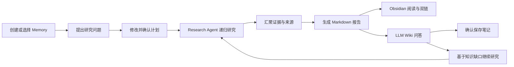
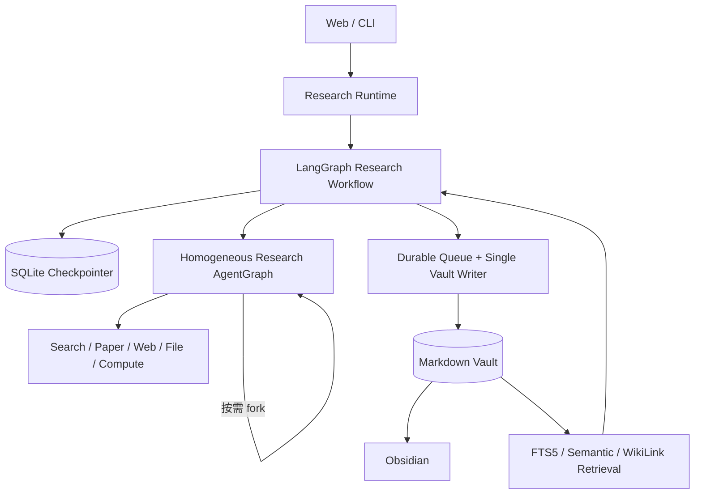

<div align="center">

# 🔬 PaperPilot

### 递归 Deep Research × LLM Wiki × Obsidian

把一次性研究，沉淀为可追溯、可问答、可继续生长的长期知识。

[](https://python.org)
[](https://www.langchain.com/langgraph)
[](#测试)
[](LICENSE)

</div>

---

## 📖 项目介绍

大多数研究 Agent 在交付报告后就结束了：下一次提问仍要从头搜索，历史证据散落在会话中，也很难在自己熟悉的知识管理工具里继续整理。

**PaperPilot** 是一个基于 LangGraph 的个人深度研究系统。它让用户先确认研究计划，再由同质 Research Agent 递归拆解问题、并行检索和汇聚证据；研究结果会写入长期 Markdown Memory，并通过 **LLM Wiki** 与 **Obsidian** 进入后续的问答、笔记和继续研究流程。

```text
一次研究：问题 → 计划确认 → 递归研究 → 带来源的报告
长期积累：报告 → LLM Wiki → Memory 问答 → 新笔记 / 继续研究
```

## ✨ 三项核心能力

| 能力 | PaperPilot 做什么 | 解决的问题 |
|---|---|---|
| 🔎 **递归 Deep Research** | 同一种 Research Agent 按需 fork，搜索网页、论文和本地资料，汇聚可追溯证据 | 复杂问题难以一次检索完整 |
| 🧠 **LLM Wiki** | 将报告、证据、来源和笔记组织为长期 Memory，支持检索问答与基于旧知识继续研究 | 研究结束后知识无法复用 |
| 🗂️ **Obsidian 原生工作流** | 使用 Markdown、frontmatter 和 WikiLink 落盘，可直接在 Obsidian 中阅读、编辑和浏览双链 | 知识被锁在聊天界面或专有数据库中 |

### 1. 递归 Deep Research

- 用户可以修改并确认 Research Brief，确认前不会启动正式研究；
- 根 Agent、子 Agent 和孙 Agent 运行同一个 AgentGraph，只在身份、深度和预算上不同；
- Agent 根据证据缺口决定继续调用工具、停止或 fork，整棵执行树共享递归、线程、工具和时间预算；
- 搜索、论文、网页、文件和计算结果最终汇聚为带来源的 Markdown 报告；
- Red/Blue 审查保留为关闭的实验路径，不接入当前产品基线。

### 2. LLM Wiki：让研究成为长期记忆

PaperPilot 的 LLM Wiki 不是另一个 Markdown 编辑器，而是建立在 Markdown Vault 之上的智能层：

- 一个 Vault 可以包含多个稳定的 `memory_id`，Memory 不依赖某次 session 或 thread；
- 报告、证据、来源、笔记和导入资料通过 WikiLink 形成知识网络；
- 可以针对当前 Memory 提问，回答附带实际命中的文件引用；
- 可以把回答整理为笔记，或导入 PDF、文本和网页；所有写入都先预览、再确认；
- 新研究会读取已有结论与知识缺口，在同一 Memory 中继续扩展；
- SQLite FTS5、可选本地语义召回和 WikiLink 邻居组成混合检索，索引可随时从 Markdown 重建。

### 3. Obsidian 原生，而不是自建编辑器

PaperPilot 负责研究、检索、引用和受控写入；Obsidian 负责阅读、手工编辑、backlinks 与知识图谱。Vault 中的 Markdown 是唯一知识真相源，PaperPilot 不要求安装 Obsidian 插件，也不会改写 `.obsidian/`。

```text
memory/
└── Memories/
    └── M-.../
        ├── Home.md
        ├── reports/
        ├── evidence/
        ├── sources/
        ├── notes/
        ├── imports/
        └── attachments/
```

## 🔄 完整使用链路



这条链路的重点不是“生成一篇报告”，而是让报告进入一个可以持续检索、验证和扩展的个人研究空间。

## 🏗️ 架构概览



几个关键设计：

- **工作流可恢复**：LangGraph checkpoint 持久化研究阶段和 interrupt，服务重启后可继续等待中的流程；
- **写入可恢复**：持久队列与单一 Vault Writer 串行提交，通过 staging、journal、内容哈希和原子发布处理崩溃与重复请求；
- **知识不锁定**：SQLite 检索数据只是可重建索引，不能反向覆盖 Markdown；
- **人在回路中**：研究计划、保存笔记、导入资料和 legacy 迁移均需要用户确认。

更完整的设计说明见 [架构文档](docs/ARCHITECTURE.md)。

## 🚀 快速开始

推荐 Python 3.11。

### 1. 安装

```bash
git clone https://github.com/boluodaixue/paperpilot.git
cd paperpilot

python -m venv .venv
source .venv/bin/activate
python -m pip install -r requirements.txt
cp .env.template .env
```

Windows PowerShell：

```powershell
python -m venv .venv
.venv\Scripts\Activate.ps1
python -m pip install -r requirements.txt
Copy-Item .env.template .env
```

在 `.env` 中填写模型和检索服务所需的 API Key。项目支持 DeepSeek、OpenAI、MiMo 和本地 OpenAI-compatible vLLM。

网页搜索默认使用 `Tavily → 秘塔 → Exa → 博查 → SerpAPI` 回退链，只调用已配置 Key 的备用源，无需部署 SearXNG 或其他常驻服务。首选源故障时会自动切换，但仍向界面发送明确的来源不可用告警；所有已配置来源都失败时才暂停整个网页搜索工具。

论文检索把 `ARXIV_READER_BACKEND` 作为首选项，并在失败或空结果时自动在 arXiv、Semantic Scholar 和 OpenAlex 之间回退。裸 arXiv ID 会先按 arXiv 标识符查询，不会再误拼为 OpenAlex Work ID。外部 HTTPS 工具统一使用平台信任库与 Mozilla CA；网页返回 403 时，只会尝试同一发布方可验证的官方 PDF，不关闭证书校验或绕过访问控制。

### 2. 启动 Web

```bash
python web/run.py
```

打开 <http://127.0.0.1:8000>，创建或选择一个 Memory，然后开始研究。

### 3. 在 Obsidian 中打开

把 `configs/default.yaml` 中 `research.vault_root` 指向的目录作为 Obsidian Vault 打开。默认目录是项目下的 `memory/`。

### CLI

```bash
python scripts/run_single.py \
  --memory-id M-your-memory \
  --query "分析 AI Agent Memory 的演进、评测方法与关键证据"
```

交互式入口：

```bash
python scripts/run_repl.py
```

## 🧭 项目演进

PaperPilot 保留了从原型到当前架构的完整 Git 提交历史，方便查看每次真实迭代，而不是把开发过程压缩成一次“最终版提交”。

| 时间 | 阶段 | 主要变化 |
|---|---|---|
| **2026.05** | DeepResearch Agent 原型 | 建立规划、检索、Memory、报告与评测基础 |
| **2026.08.23–27** | PaperPilot 研究闭环 | 加入证据层、证据图、Web UI、动态 fork 和 Obsidian 导出探索 |
| **2026.08.28** | LangGraph 主线重构 | 收敛为同质 Research AgentGraph，补齐确认、递归边界与 checkpoint 恢复 |
| **2026.08.28–29** | LLM Wiki + Obsidian | 完成长期 Memory、受控笔记与导入、崩溃一致写入、全文与混合检索 |

当前方向与后续计划见 [路线图](docs/ROADMAP.md)。每一个功能阶段的具体变化也可以直接通过 Git 历史查看。

## 🧪 测试

```bash
pytest -q
```

当前确定性测试覆盖：

```text
Evidence 闭环、L1–L5 上下文压缩、递归预算、checkpoint/Writer 崩溃恢复、Web/CLI 与 Memory 工作流
```

测试覆盖递归与预算、checkpoint 恢复、用户确认、多 Memory 隔离、Writer 崩溃恢复、并发冲突、Markdown/WikiLink 契约、导入、FTS5、语义降级以及 Web/CLI 入口。

## 🛠️ 技术栈

| 层级 | 技术 |
|---|---|
| Agent 工作流 | LangGraph |
| Web | FastAPI + SSE |
| 模型 | DeepSeek / OpenAI / MiMo / vLLM |
| 知识存储 | Markdown + frontmatter + WikiLink |
| 工作流持久化 | SQLite Checkpointer |
| 检索 | SQLite FTS5 + sentence-transformers + WikiLink |
| 可观测性 | Langfuse |
| 知识管理 | Obsidian |

## 📁 项目结构

```text
paperpilot/
├── configs/          # 模型、工具、Runtime 与检索配置
├── docs/             # 当前架构与路线图
├── evaluation/       # 固定离线评测
├── scripts/          # CLI、评测和模型准备工具
├── src/research/     # Workflow、AgentGraph、Memory、Writer、Retrieval
├── src/tools/        # 搜索、论文、网页、文件与计算工具
├── tests/            # 确定性测试和故障注入
└── web/              # FastAPI + 本地 Web UI
```

## 🗺️ Roadmap

- [x] 同质递归 Research AgentGraph
- [x] 基于必要要求、证据和下一步价值的研究充分性与终止机制
- [x] Research Brief 确认与 SQLite checkpoint 恢复
- [x] 多 Memory Markdown Vault 与 Obsidian 工作流
- [x] LLM Wiki 问答、受控笔记、导入与继续研究
- [x] 单一 Vault Writer 与崩溃一致性
- [x] FTS5 + 可选语义 + WikiLink 混合检索
- [ ] 完成一次真实模型、真实搜索与服务重启恢复的公开演示
- [ ] 增加截图、样例报告与 60–90 秒演示视频

## 📄 License

[MIT](LICENSE)
