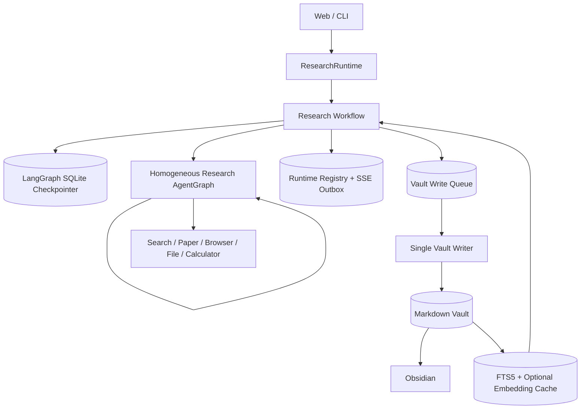

# PaperPilot 当前架构

## 1. 目标

PaperPilot 是一个面向个人深度研究的本地 Agent 系统。它把研究计划确认、递归研究、证据汇聚、Markdown 持久化、Obsidian 阅读和长期 Memory 继续研究串成一条可恢复链路。

系统优先保证：

- 一个清晰、可解释的 Research AgentGraph；
- 用户在关键写入前保持控制权；
- 进程重启后仍能定位并恢复工作流；
- Markdown 是长期知识的唯一真实来源；
- 索引、缓存和运行账本各自只承担单一职责。

它不是多租户 SaaS，不以认证、计费、Kubernetes 或多区域容灾为设计目标。

## 2. 总体结构



所有产品入口最终都通过 `src/research/runtime.py` 组装相同的 Workflow、AgentGraph、checkpointer、Memory Store 和 Writer，不维护第二条研究主链。

## 3. 同质 Research AgentGraph

根、子、孙执行 `src/research/agent_graph.py` 中的同一个图。每个实例都能：

- 分析任务并调用研究工具；
- 判断继续、停止或 fork；
- 汇聚子 Agent 返回的结构化结果；
- 返回带来源、限制和停止原因的 Research Result。

差异只来自执行身份：

```text
root depth=0
└── child depth=1
    └── grandchild depth=2  # 禁止继续 fork
```

fork 必须同时满足可并行、需要上下文隔离和预计存在足够工具链深度。全树共享最大线程、工具调用、时间、token 和重试预算；达到限制后返回明确 `stop_reason`。

根 Agent 只额外承担用户交互和最终报告发布权限，不是另一种 Manager Agent。

## 4. Research Workflow

外层 Workflow 负责 AgentGraph 不应承担的产品流程：

1. 读取用户问题和选定 `memory_id`；
2. 从当前 Memory 检索相关旧知识；
3. 生成可编辑 Research Brief；
4. 通过 LangGraph interrupt 等待用户修改或确认；
5. 调用根 Research AgentGraph；
6. 生成最终 Markdown 报告；
7. 通过 Vault Writer 持久化；
8. 可选执行一次默认关闭的 Red/Blue 报告复核。

保存问答笔记、导入资料和 legacy 迁移也使用独立的可恢复 Workflow，并保持“预览—确认—写入”边界。

## 5. 状态归属

### LangGraph State + AsyncSqliteSaver

保存单个 thread 的唯一工作流状态：阶段、Brief、interrupt、提案、确认、模型结果、写入意图和终态。产品 Web/CLI 使用 `AsyncSqliteSaver`，因此等待确认和已 checkpoint 的任务可以跨进程重启恢复。

### Runtime Registry

只保存：

- session/task/thread/memory 的定位关系；
- 恢复调度租约；
- SSE 事件 outbox 和终态保留时间。

Registry 不保存 Research Brief、Markdown 正文或第二份确认状态。

### Chat Store

保存会话、消息、绑定和知识文件指针，不复制 Vault 中的报告正文。

## 6. Memory 与 Vault

每个长期 Memory 使用稳定 `memory_id`：

```text
Memories/M-.../
├── Home.md
├── reports/
├── evidence/
├── sources/
├── notes/
├── imports/
└── attachments/
```

Markdown frontmatter 保存最小身份和来源元数据；报告通过完整 Vault 相对 WikiLink 指向证据，证据再指向来源。关系由 WikiLink 和 Obsidian backlinks 表达，不维护 Evidence Graph。

路径解析拒绝绝对路径、`..` 逃逸、symlink/junction/reparse 和跨 Memory 写入。FileReader 只有在某次运行明确绑定当前 Memory 或受控上传根时才对模型可见。

## 7. 单一 Vault Writer

多文件写入不能只依靠进程内锁。所有产品写操作先进入 SQLite 持久队列，再由一个持有 generation-fenced lease 的 Writer 串行提交：

```text
Workflow / API workers
        ↓
Persistent write queue
        ↓
Single Vault Writer
        ↓
same-volume staging + journal
        ↓
Markdown Vault
```

Writer 在隐藏 staging 中准备完整变更，记录预期旧哈希和目标新哈希，按确定性顺序发布，并在崩溃后根据 journal 完成或回滚。重复请求通过幂等键复用结果；外部编辑冲突不会被静默覆盖。

## 8. 检索

### 全文检索基线

Vault 外 SQLite FTS5 保存按 `vault_scope + memory_id` 隔离的文档和有界分块。索引记录路径、内容哈希、mtime、标题、frontmatter、正文和 WikiLink；查询前增量同步并周期性全哈希 reconciliation，返回前重新校验真实 Markdown。

### 可选语义混合

显式开启后，系统只为选定 Memory 的分块生成本地 embedding，并按内容哈希和模型版本缓存。FTS、语义和一跳 WikiLink/backlink 分别召回，再以固定权重的确定性 RRF 合并。

模型缺失、加载失败、数量/维度错误或非法向量都会明确降级到 FTS5，不使用伪随机向量。索引可随时删除重建，不能反向写 Markdown。

## 9. Obsidian 边界

Obsidian 是外部 Markdown 阅读器和编辑器。PaperPilot 只生成安全 URI 帮助用户打开 `Home.md`、报告或引用，不检测插件、不写 `.obsidian/`，也不把 Obsidian 变成工作流状态源。

## 10. 可观测性与测试

Langfuse 可选且默认关闭。trace 记录 thread/memory 身份、节点、工具、检索路径、分数和写入状态，但不主动记录附件字节或完整私有 Markdown。

确定性测试覆盖 AgentGraph、fork/递归预算、interrupt/checkpoint、重启恢复、Writer 故障注入、多 Memory 隔离、导入、检索和 Web/CLI。真实模型、网络和 Obsidian 作为额外 smoke test。

## 11. 明确不做

- 固定 Manager/Planner/Summarizer 角色流水线；
- Evidence Graph、图数据库或第二知识 Repository；
- 默认跨 Memory 检索；
- 未经确认的自动写入或迁移；
- 面向多租户公网 SaaS 的认证、计费和基础设施。
