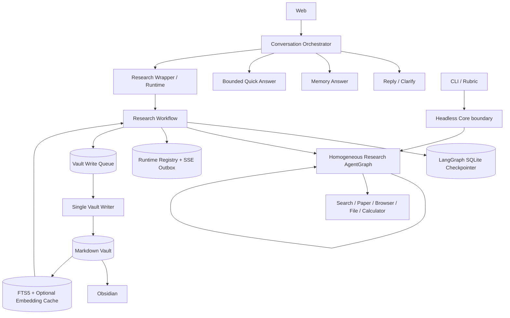

# PaperPilot 当前架构

> 当前分支的实现、验证与迁移边界以
> [`CURRENT_STATUS.md`](CURRENT_STATUS.md) 为准。本文件描述完整系统结构。

## 1. 目标

PaperPilot 是一个面向个人深度研究的本地 Agent 系统。统一对话层把普通聊天、Memory 问答、快速联网和深度研究分开；研究链再把计划确认、递归研究、证据汇聚、Markdown 持久化、Obsidian 阅读和长期 Memory 继续研究串成可恢复流程。

系统优先保证：

- 一个清晰、可解释的 Research AgentGraph；
- 用户在关键写入前保持控制权；
- 进程重启后仍能定位并恢复工作流；
- Markdown 是长期知识的唯一真实来源；
- 索引、缓存和运行账本各自只承担单一职责。

它不是多租户 SaaS，不以认证、计费、Kubernetes 或多区域容灾为设计目标。

## 2. 总体结构



Web 产品能力先通过 `src/conversation/` 编排，普通聊天与 Quick Answer 不进入 Research Workflow。当前稳定 Web 研究仍由 `src/research/runtime.py` 装配；Headless Core 合同已经抽出，但 CLI、Rubric 与 Web Wrapper 尚未全面迁移，不能把目标依赖图误写成已完成调用图。

## 3. 同质 Research AgentGraph

根、子、孙执行 `src/research/agent_graph.py` 中的同一个图。每个实例都能：

- 分析任务并调用研究工具；
- 判断继续、停止或 fork；
- 汇聚子 Agent 返回的结构化结果；
- 返回带来源、限制和停止原因的 Research Result。

差异只来自执行身份：

```text
root depth=0
└── child depth=1
    └── grandchild depth=2  # 禁止继续 fork
```

fork 必须同时满足可并行、需要上下文隔离和预计存在足够工具链深度。全树共享最大线程、工具调用、研究时间、token 和重试预算；达到限制后返回明确 `stop_reason`。Root 可通过 `root_finalization_grace_seconds` 获得研究截止后的独立最终合成窗口；该窗口不能用于检索、Fork 或 Child/Grandchild 工作。

### 研究充分性与终止机制

提交 `bdf310a` 加入的固定来源数量、方向数乘二、连续 ready 轮次和全局零增量完成门已经移除。来源数和循环数只作为观察量，不能证明关键问题已经覆盖，也不会在存在可行动关键缺口时禁用研究工具。

用户确认后的 Research Brief 在 `prepare_research` 中形成稳定必要要求。相同 Research Agent policy 在同一张图的 `assess_research_state` 节点中根据目标覆盖、Evidence ID 对应关系、关键缺口、下一轮价值和硬资源边界产生 `Continue`、`Replan` 或 `Stop Research`：

```text
think_and_plan
  → use_tools / fork_children
  → assess_research_state
      ├─ Continue / Replan → think_and_plan（工具保持可用）
      └─ Stop Research → finalize_output → synthesize
```

requirements、coverage、critical gaps、next actions、真实 strategy attempts 和 decision 都进入 checkpoint。程序确定性拒绝缺失 requirement、未知 Evidence ID、矛盾的覆盖/缺口/动作组合、没有新策略的 Replan、没有多种真实 `no_progress` 策略的 Exhausted，以及模型伪造的预算或取消原因。工具返回唯一页面并不自动等于研究进展：只有被合法 coverage 引用的 Evidence ID 才把对应 strategy attempt 记为 `evidence_found`，否则记为 `no_progress`。评估 JSON 和最终 JSON 各允许一次无工具结构修复；失败后使用保守 fallback，不覆盖此前已验证的研究状态，也不因格式错误禁用工具。

结果分别保存 `research_status`、`termination_reason` 和 `output_status`。停止原因区分 `coverage_complete`、`saturated`、`evidence_exhausted`、`budget_forced`、`tool_failure` 和 `user_cancelled`；子任务 `partial` 继续披露，但根状态只按根 Brief 的最终覆盖重新判断。RCS 只在最终评测输出中计算五个维度，不进入运行时停止路由。ResearchBench 可选使用持久 SQLite checkpoint 逐题恢复，并把规则分、完整报告分块 LLM Judge 和二者组合分分开保存；Judge 使用独立的 `modules.judge` 采样参数，不参与运行时终止，也不改变 Research policy。

外部信息源异常使用确定性分类器，而不是等到最终报告才作为普通工具错误披露。额度耗尽、套餐不可用和认证失败会产生 checkpointed `tool_unavailable` 事件并打开工具级熔断；OpenAlex 标识符适配 404 作为适配器异常同样熔断。HTTP 403、TLS/证书失败只隔离具体来源，限流标记为服务降级，仍允许切换其他来源。熔断后的重复调用产生 `tool_call_skipped_unavailable`，不计作真实外部调用；全部研究工具不可用时以 `tool_failure` 结束。结构化告警同步进入 SSE、API 结果、最终报告和父子结果汇聚，错误诊断中的凭据在公开前会被脱敏。

外部 HTTP 客户端使用平台信任库叠加 Mozilla CA，并始终保留主机名和证书验证。论文工具按标识符类型路由：OpenAlex 只直接接收其支持的 Work/DOI/PubMed ID，裸 arXiv ID 使用 arXiv `id_list`，失败后依次回退 Semantic Scholar 与 OpenAlex 搜索。任一首选后端失败或返回空结果都可继续使用其他免费学术后端；全部失败时才生成工具级不可用异常。Browser 对 403 不绕过访问控制，只在可确定同一发布方时读取官方 PDF，并把实际替代 URL 写入 Evidence 来源。

完整契约、状态、路由和验收标准见 `docs/RESEARCH_SUFFICIENCY_TERMINATION_DESIGN.md`。

根 Agent 只额外承担用户交互和最终报告发布权限，不是另一种 Manager Agent。

### Task、Research State、Knowledge Store 与 Working Context

研究运行时明确分离四类数据：用户确认后的 Task 永久定义完成契约；checkpointed Research State 保存 coverage、critical gaps、Claim/Evidence 映射、策略、预算与终止；Knowledge Store 保存完整工具 artifact、Evidence 和来源；Working Context 只是在每次 policy 调用前按当前 requirement 生成的有界临时投影。

工具结果不能先截断再保存。完整 artifact 必须先通过现有持久写队列交给单一 Vault Writer，以内容哈希和幂等键原子发布到 root-thread 隔离的 `Artifacts/<thread-scope>/`；并行子 Agent 只能提交写入意图。Working Context 使用三层管理：L1 Artifact Offload、L2 确定性清理、L3 State Projection + Semantic Memo。L3 在替换旧对话的同一次操作中保存结构化状态和有引用约束的语义 Memo；Memo 失败时只回退到确定性 State Projection。当前执行树可通过 FileReader 的 `artifact` 虚拟根按 ID 回读父子 Agent 的原始 artifact。任何 artifact 写入或复核失败都保留完整 raw payload。

详细数据契约、水位、滞回、恢复和分级验收见 `docs/RESEARCH_SUFFICIENCY_TERMINATION_DESIGN.md` 第 13 节。

## 4. Research Workflow

外层 Workflow 负责 AgentGraph 不应承担的产品流程：

1. 读取用户问题和可选 `memory_id`；
2. 已选 Memory 时检索相关旧知识；
3. 生成可编辑 Research Brief；
4. 通过 LangGraph interrupt 等待用户修改或确认；
5. 确认时若会话未绑定 Memory，则确定性创建 managed Memory，并绑定 checkpoint、Registry 与 session；
6. 调用根 Research AgentGraph；
7. 生成最终 Markdown 报告；
8. 通过 Vault Writer 持久化；
9. 结束并返回结果；Red/Blue 报告复核保持关闭，不接入当前产品基线。

保存问答笔记、导入资料和 legacy 迁移也使用独立的可恢复 Workflow，并保持“预览—确认—写入”边界。

## 5. 状态归属

### LangGraph State + AsyncSqliteSaver

保存单个 thread 的唯一工作流状态：阶段、Brief、interrupt、提案、确认、模型结果、写入意图和终态。产品 Web/CLI 使用 `AsyncSqliteSaver`，因此等待确认和已 checkpoint 的任务可以跨进程重启恢复。

### Runtime Registry

只保存：

- session/task/thread/memory 的定位关系；
- 恢复调度租约；
- SSE 事件 outbox 和终态保留时间。

Registry 不保存 Research Brief、Markdown 正文或第二份确认状态。

### Chat Store

保存会话、消息、绑定和知识文件指针，不复制 Vault 中的报告正文。

## 6. Memory 与 Vault

每个长期 Memory 使用稳定 `memory_id`：

```text
Memories/M-.../
├── Home.md
├── reports/
├── evidence/
├── sources/
├── notes/
├── imports/
└── attachments/
```

Markdown frontmatter 保存最小身份和来源元数据；报告通过完整 Vault 相对 WikiLink 指向证据，证据再指向来源。关系由 WikiLink 和 Obsidian backlinks 表达，不维护 Evidence Graph。

路径解析拒绝绝对路径、`..` 逃逸、symlink/junction/reparse 和跨 Memory 写入。FileReader 只有在某次运行明确绑定当前 Memory 或受控上传根时才对模型可见。

## 7. 单一 Vault Writer

多文件写入不能只依靠进程内锁。所有产品写操作先进入 SQLite 持久队列，再由一个持有 generation-fenced lease 的 Writer 串行提交：

```text
Workflow / API workers
        ↓
Persistent write queue
        ↓
Single Vault Writer
        ↓
same-volume staging + journal
        ↓
Markdown Vault
```

Writer 在隐藏 staging 中准备完整变更，记录预期旧哈希和目标新哈希，按确定性顺序发布，并在崩溃后根据 journal 完成或回滚。重复请求通过幂等键复用结果；外部编辑冲突不会被静默覆盖。

## 8. 检索

### 全文检索基线

Vault 外 SQLite FTS5 保存按 `vault_scope + memory_id` 隔离的文档和有界分块。索引记录路径、内容哈希、mtime、标题、frontmatter、正文和 WikiLink；查询前增量同步并周期性全哈希 reconciliation，返回前重新校验真实 Markdown。

### 可选语义混合

显式开启后，系统只为选定 Memory 的分块生成本地 embedding，并按内容哈希和模型版本缓存。FTS、语义和一跳 WikiLink/backlink 分别召回，再以固定权重的确定性 RRF 合并。

模型缺失、加载失败、数量/维度错误或非法向量都会明确降级到 FTS5，不使用伪随机向量。索引可随时删除重建，不能反向写 Markdown。

## 9. Obsidian 边界

Obsidian 是外部 Markdown 阅读器和编辑器。PaperPilot 只生成安全 URI 帮助用户打开 `Home.md`、报告或引用，不检测插件、不写 `.obsidian/`，也不把 Obsidian 变成工作流状态源。

## 10. 可观测性与测试

Langfuse 可选且默认关闭。trace 记录 thread/memory 身份、节点、工具、检索路径、分数和写入状态，但不主动记录附件字节或完整私有 Markdown。

确定性测试覆盖 AgentGraph、fork/递归预算、interrupt/checkpoint、重启恢复、Writer 故障注入、多 Memory 隔离、导入、检索和 Web/CLI。真实模型、网络和 Obsidian 作为额外 smoke test。

## 11. 明确不做

- 固定 Manager/Planner/Summarizer 角色流水线；
- Evidence Graph、图数据库或第二知识 Repository；
- 默认跨 Memory 检索；
- 未经确认的自动写入或迁移；
- 面向多租户公网 SaaS 的认证、计费和基础设施。
