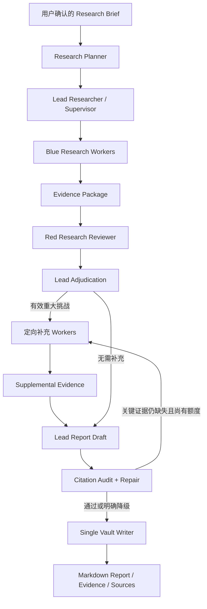

# PaperPilot Research Agent V2 整体设计

## 1. 文档状态

- 状态：已确认，等待实施
- 日期：2026-08-31
- 目标：把当前自由递归的同质 Research Agent 树，演进为研究专用、可恢复、受控的一层 Supervisor–Worker 系统。
- 约束：保留现有搜索、证据、预算、检查点、Memory/Vault、外部工具异常告警和评测基础设施。

## 2. 核心决策

1. 使用 `Research Planner → Lead Researcher → Blue Workers → Red Reviewer → Lead Draft → Citation Audit → Persist` 主流程。
2. Blue Research Workers 同质、并行、只有一层；默认 `max_fork_depth=1`，Worker 不能创建孙 Agent。
3. 不引入严格的“对象 × 任务 × 信息类型”覆盖矩阵；使用轻量 `CoreQuestion` 清单记录必须回答的问题、负责人和未解决项。
4. Red Reviewer 在写报告前审查研究包，主动寻找遗漏、弱证据、冲突、不可比数据和过度推断。
5. Lead Researcher 负责最终写作，不设置独立 Writer Agent。
6. 报告草稿中的重要陈述必须携带内部 Evidence ID；Citation Audit 在正式持久化前验证、修复或删除不受支持的陈述。
7. 所有反馈循环都有硬上限：最多两轮研究、一次完整 Red 审查、一次补充研究和一次引用修复。

## 3. 总体结构



外层现有 Workflow 继续负责 Research Brief 确认、LangGraph interrupt、checkpoint 恢复和最终写入。V2 只替换确认后的研究编排核心。

## 4. 角色职责

### 4.1 Research Planner

输入用户确认的 `ResearchBrief`，输出轻量 `ResearchPlan`：

- `core_questions`：少量、稳定、必须回答的研究问题；
- `report_outline`：报告预期章节和交付结构；
- `source_guidance`：优先来源、时间、语言和禁止假设；
- `work_hints`：适合并行的方向，但不直接决定所有 Worker 数量。

Planner 不调用搜索工具。结构化输出失败允许一次无工具修复，仍失败则从 Brief 的 `directions` 生成保守计划。

### 4.2 Lead Researcher / Supervisor

Lead 持有全局研究状态，但不直接进行开放式网页搜索。它负责：

- 把 Core Questions 组合成有边界的 `WorkPacket`；
- 按复杂度发起 1–N 个并行 Blue Workers；
- 合并结构化发现、Evidence ID、失败和告警；
- 判断是否需要 Red 审查后的定向补充；
- 使用通过审查的证据撰写最终草稿；
- 在研究、写作和引用阶段之间保留预算。

Lead 的控制动作只有 `ConductResearch`、`ResearchComplete` 和有界内部反思，不获得 `fork_research`。

### 4.3 Blue Research Worker

所有 Worker 使用同一个 Worker Graph，只因 `WorkPacket` 不同而不同。Worker：

- 先搜索发现来源，再打开网页、论文或 PDF；
- 把搜索摘要视为线索，不作为重要结论的最终证据；
- 返回结构化 `EvidenceClaim`、来源定位、限制、冲突和未解决项；
- 继承现有工具熔断、预算、artifact、Evidence 和上下文压缩机制；
- 不写面向用户的子报告；
- 不创建子 Agent。

### 4.4 Red Research Reviewer

Red Reviewer 不调用外部工具，不重做全部研究，也不写报告。它只读取 Research Plan、Evidence Package 和来源元数据，输出 `ResearchChallenge`：

- `missing_question`：核心问题遗漏；
- `unsupported_claim`：结论超出证据；
- `weak_source`：关键结论只依赖低质量或二手来源；
- `conflict`：来源存在未处理冲突；
- `non_comparable`：数据测试条件不可横向比较；
- `uncertainty`：推断被写成事实或置信度不当。

Lead 对每个挑战返回 `accept`、`reject` 或 `defer`。只有被接受且重要度高的挑战可以触发一轮定向补充研究。

### 4.5 Lead Report Draft

Lead 使用 Research Brief、Research Plan 和已审查 Evidence Package 生成报告草稿。规则：

- 重要事实和结论就近携带内部 Evidence ID；
- 无证据时必须删去、降级为推断或明确列为未解决；
- 不把 Research Brief、运行日志或 Evidence Ledger 当作研究成果正文；
- 比较任务优先使用表格呈现可比数据和测试条件；
- Writer 阶段不再进行广泛搜索。

### 4.6 Citation Audit + Repair

Citation Audit 是受约束的验证节点，不是完整自主 Agent。它先做确定性检查，再做一次模型语义检查：

1. 每个 Evidence ID 必须存在且能解析为已持久化或待持久化 Evidence；
2. 引用来源、locator 和 excerpt 必须能支持陈述范围；
3. 同一 URL 使用稳定引用身份；
4. 重要陈述不得没有引用；
5. 搜索摘要不能替代已打开的正文证据。

修复动作仅允许：

- 补上已经存在的正确 Evidence ID；
- 替换错误 Evidence ID；
- 缩小、限定或删除不受支持的陈述；
- 把冲突和不确定性显式写入正文；
- 对仍缺失的核心证据发起一次有界定向补充，然后只重写受影响段落。

Citation Audit 不能发明来源。无法修复时，报告必须以 `partial` 和明确 unresolved 内容结束，而不是带错误引用发布。

## 5. 核心数据契约

### 5.1 ResearchPlan

```text
plan_id
brief_revision
core_questions[]     # question_id, description, required, priority
report_outline[]
source_guidance[]
work_hints[]
```

### 5.2 WorkPacket

```text
packet_id
objective
question_ids[]
expected_output
source_guidance[]
max_tool_calls
deadline / token_budget
wave                 # initial | supplemental
```

### 5.3 EvidenceClaim

```text
claim_id
claim
question_ids[]
evidence_ids[]
source_ref
locator
excerpt
limitations
confidence
comparability_notes
```

`EvidenceItem` 继续是来源可定位的底层事实；`EvidenceClaim` 是可被报告使用的陈述与一条或多条 Evidence 的映射。这样避免把一份来源强行绑定到单一要求。

### 5.4 ResearchChallenge

```text
challenge_id
category
target_question_ids[]
target_claim_ids[]
reason
severity
requested_evidence
suggested_query
status               # pending | accepted | rejected | deferred | resolved
```

### 5.5 CitationIssue

```text
issue_id
claim_text / section
evidence_ids[]
category             # missing | invalid | overclaim | conflict | locator
severity
repair_action
status
```

所有契约必须可序列化并进入 LangGraph checkpoint；恢复不能依赖进程内对象。

## 6. 状态机与有界循环

```text
plan_research
  → supervise_initial
  → run_blue_workers
  → review_research_red
  → adjudicate_challenges
      ├─ supplemental_needed → run_supplemental_workers
      └─ otherwise ----------→ draft_report
  → citation_audit
      ├─ one critical follow-up allowed → run_supplemental_workers → redelta_draft
      └─ repair / qualify / remove ------→ persist_result
```

硬约束：

- Worker 深度固定为 1；
- 初始和补充研究合计最多两波；
- Red 完整审查最多一次，补充后只复查原有高严重度挑战；
- Citation Repair 最多一次；
- 每个节点进入前检查全局时间、token、工具和重试预算；
- Lead 写作与 Citation Audit 使用预留预算，不得被 Workers 消耗。

## 7. 失败与降级

- 单个 Worker 失败：保留其他结果，Lead 可重派一次或记录 unresolved；
- 搜索服务不可用：沿用现有即时告警、熔断和后端降级；
- Red Reviewer 不可用：记录质量告警，回退到 Supervisor 的轻量缺口检查；
- Citation 模型检查不可用：执行确定性引用检查；确定性检查不通过则不得静默发布为 completed；
- 写入失败：沿用持久写队列、generation-fenced lease、journal 和幂等恢复；
- checkpoint 恢复：不得重复已完成 Worker、Red 审查、引用修复或最终写入。

## 8. 保留与替换边界

### 保留

- `workflow.py` 的 Brief、确认、中断、恢复和产品入口；
- 当前工具调用、Evidence 提取、artifact、上下文压缩和工具异常分类；
- 全局时间、token、线程、工具调用和重试预算；
- Memory/Vault、Single Vault Writer、FTS 和 Obsidian 边界；
- RCS、ResearchBench、完整报告 Judge 和运行追踪。

### 重构或新增

- 以专用 Supervisor Graph 替换自由递归 `fork_research`；
- 从当前同质 AgentGraph 中抽取无 fork 的 Worker Graph；
- 把现有报告后置 Red/Blue 复核拆成研究前 Red Challenge 与引用修复门；
- 新增 ResearchPlan、WorkPacket、EvidenceClaim、Challenge 和 Citation Audit 状态；
- 把报告正式持久化移动到 Citation Audit 通过或明确降级之后。

## 9. 非目标

- 不建立严格笛卡尔覆盖矩阵；
- 不引入孙 Agent 或无界辩论；
- 不照搬参考仓库的搜索、抓取或持久化实现；
- 不新增第二套 Memory、Evidence Repository 或报告写入通道；
- 不在 V2 初期删除 Legacy Graph；先以配置开关灰度验证，再决定退役。

## 10. 完成标准

- 每个 required Core Question 至少被分配、得到证据或明确标记 unresolved；
- Worker 不能调用 fork，线程树深度不超过 1；
- Red Challenge 和裁决可从 checkpoint 恢复且不会重复执行；
- 报告中的 Evidence ID 全部可解析，重要陈述的引用覆盖率至少 80%；
- 没有证据时拒绝生成貌似可靠的结论；
- 相同 canary 不再出现研究资源几乎全部集中到一个方向；
- 完整回归测试通过，V2 关闭时 Legacy 行为保持兼容。
